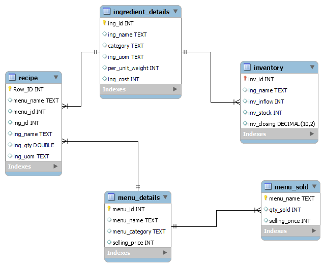
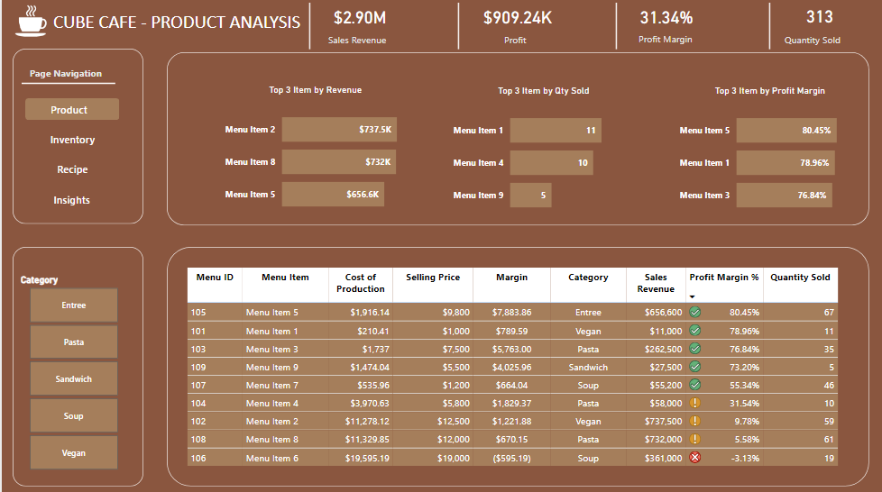
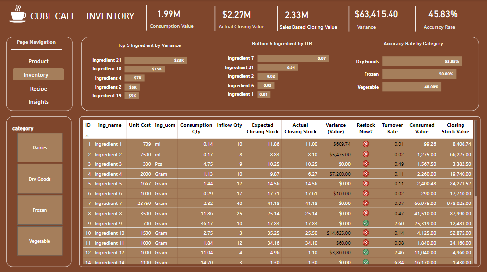
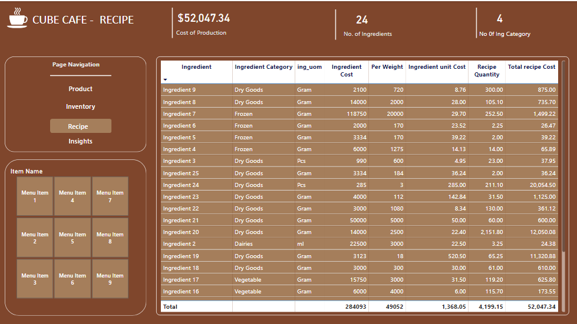

# Cost & Inventory Management Solution for Cube Cafe


## Table of Contents
- [Introduction](#introduction)
- [Problem Statement](#problem-statement)
- [Solution Steps](#solution-steps)
- [Skills Demostrated](#skills-demostrated)
- [Modelling](#modelling)
- [SQL codes for product table](#sql-codes-for-product-table)
- [Visualization](#visualization)
- [Insights and Recommendations](#insights-and-recommendations)


## Introduction
This project aimed to develop a comprehensive cafe cost and inventory management solution specifically for an imaginary cafe called **Cube Cafe**. 
Utilizing a relational database, the system streamlines operations, optimizes inventory, and fosters data-driven decision making.


## Problem Statement

**Cube Cafe** faces critical challenges in cost management and inventory control. Difficulties exist in:
1. Determining accurate costs for menu items: This hinders the ability to set optimal prices that reflect true product value and ensure profitability.
2. Gaining clear insights into ingredient consumption based on sales data: This lack of transparency makes it difficult to effectively manage inventory, leading to potential issues of wastages, theft, overstocking, and understocking.


### Solution Steps

Gathered data on menu, recipes, ingredients, sales, and inventory using Excel.
Created a new database using MySQL benchmarks named "**cube_cafe**"
Create tables for menu, recipes, ingredients, sales, and inventory.
Generated queries and views for menu costing and ingredient consumption rate.
Connected database to Power BI
Build a dashboard to visualize key metrics and insights for effective decision making.


## Skills Demostrated
### MySQL 
- Creating Database, Tables, and Views
- Writing customs queries
- Altering tables
- Modifying columns
- Connecting MySQL database to Power BI

### Power BI 
- DAX
- Quick measures
- Page navigation
- Button
- Data visualization.

  

## Modelling



## SQL codes for product table

```-- joined full table view created with menu-details table
SELECT
	ft.menu_id,
	ft.menu_name,
	ft.menu_category,
	ft.quantity_sold,
	ROUND(SUM(total_recipe_cost),2) AS menu_cost_price,
	md.selling_price
FROM
	full_table ft  -- view created
LEFT JOIN menu_details md
	ON ft.menu_name = md.menu_name
GROUP BY
	ft.menu_id,
	ft.menu_name,
	ft.menu_category,
	ft.quantity_sold,
	md.selling_price;
```


## SQL code for Inventory Table

```
SELECT
	ft.ing_id,
    ft.ing_name,
    ft.category,
    ft.ing_uom,
    ft.ing_cost,
    ft.per_unit_weight,
    SUM(ing_qty_consumed) AS consumed_weight,
    ROUND(((SUM(ing_qty_consumed))/ ft.per_unit_weight),2) AS consumed_qty,
    iv.inv_inflow,
    iv.inv_stock,
    iv.inv_closing,
   ROUND((iv.inv_stock+iv.inv_inflow)-(ROUND(((SUM(ing_qty_consumed))/ ft.per_unit_weight),2)),2) AS remaining_stock
FROM
	full_table ft
LEFT JOIN
	inventory iv
    ON ft.ing_id = iv.inv_id
GROUP BY
	ft.ing_id,
    ft.ing_name,
    ft.ing_uom,
    ft.ing_cost,
    ft.per_unit_weight,
    iv.inv_inflow,
    iv.inv_stock,
    ft.category,
    inv.inv_closing;
```


## Visualization
The dashboard comprises of four pages
1. Product
2. Inventory
3. Recipe
4. Insights & Recommendations

**You can find the link to the dashboard** [here](https://app.powerbi.com/view?r=eyJrIjoiYTg0ZGIxZjAtYmE0Yy00NDU4LTkwYTQtMTU0NmFkMDg3NmM5IiwidCI6ImRmODY3OWNkLWE4MGUtNDVkOC05OWFjLWM4M2VkN2ZmOTVhMCJ9)

## Product Performance Dashboard


## Inventory Page


## Recipe Page



### Insights and Recommendations

### 1. Insight:
**Menu Item 2** has generated the highest sales revenue, **totaling $737.5K**, indicating substantial customer demand and potential for further growth. Despite this, its profit margin of **9.78% falls well below the average of 31%.**
While the high sales figures suggest a strong market presence, the low profit margin raises concerns regarding the efficiency of cost management and operational processes. 

### Recommendation:
- It's imperative for the business to conduct a thorough analysis to identify the underlying reasons for the subpar profit margin. Is it due to high ingredient costs, operational inefficiencies, or other factors?

### 2. Insights
**Menu Item 6** is presenting a notable challenge for the business, with a negative profit margin of -3.13%. This indicates that the cost of producing the item surpasses its selling price by $595, resulting in a loss with each sale.
A further investigation unveils that __**Ingredient 24 contributes a staggering 97% to the overall cost**__, suggesting it may be disproportionately expensive.

### Recommendation: 
It is imperative to conduct a detailed analysis of the specific cost associated with Ingredient 24 in comparison to its market value and similar alternatives. 
Explore avenues for cost reduction, such as renegotiating terms with suppliers or identifying alternative ingredients that offer a more favorable cost-benefit ratio. 

### 3. Insights
The variance analysis highlights **Ingredient 21** as the primary concern, with **a significant $23,000** deviation between its expected and actual closing balances. Additionally, it exhibits the lowest inventory turnover rate compared to other ingredients.
Such a substantial variance could stem from various factors including theft, waste, or inaccuracies in inventory counting procedures.

### Recommendation:
- Review the purchasing practices related to Ingredient 21, assessing factors like ordering frequency and quantity to ensure alignment with actual usage and demand.
- Conduct a thorough investigation to identify the root causes of the variances, facilitating a deeper understanding of underlying issues.
